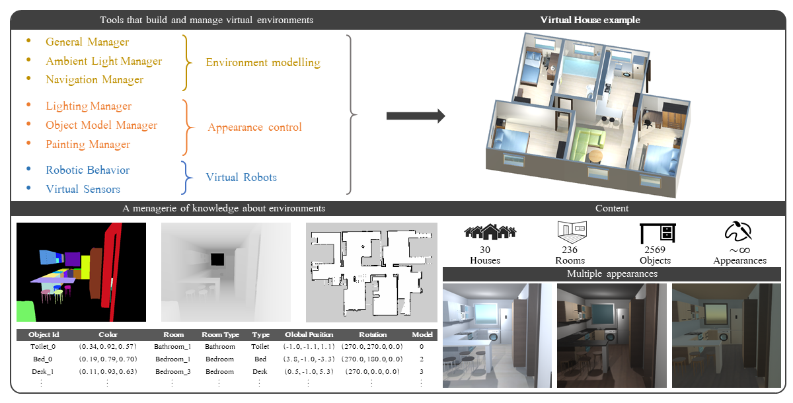

<div align="center">
  
</div>

# Introduction
Robot@VirtualHome consists of a set of tools that can instantiate, change the appearance of, and provide knowledge from up to 30 virtual houses. Each of these has been designed out of real houses' resources (plans, images, point clouds, etc.) hosted on [Idealista](www.idealista.com), a popular real estate website in Spain. Objects appearing in real houses have also been replicated using virtual objects. These are 3D models of the same type (\eg chair, table, microwave, etc.) as the objects found in the real environment and which are placed in the equivalent location to the position where the objects they recreate are. All these objects, as well as all the rooms, have been manually labeled in order to also provide ground truth information about the types of the elements they imitate, hence augmenting the geometric and appearance information with semantic knowledge.


  
## How to use?
This work has been developed in Unity 2020.3.14 (2020 and later versions should be compatible). To start using this ecosystem, you need to have [Unity](https://unity3d.com/es/get-unity/download)  installed and download the project.

Then you only have to open the scene located in: "Assets/RobotAtVirtualHome/Scenes/RobotAtVirtualHome".
  

  
## Features
**1. Customize your environment:**
In the gameobject "map" you can find the "GeneralManager" script which will help you configure many of the appearance aspects of the environment.

>**House Selected:** You can choose which house to instantiate between 1 and 30. (0 to choose a random house).
>
>**Record Hierarchy:** Check if you want to save a log file with information about the instantiated map.
>
>**Transparent Roof:** Check if you want the roof of the house to be transparent to make it easier to see the execution. Note: this will not cause ambient light problems.
>
>**Initial State Door:** Choose the state of the doors, which modifies the navigation area of the agents. It can be set to None - will be kept as default, on - all doors open, off - all doors closed, or random. 
>
>**Initial State General Light:** Modifies the status of the ceiling lights in each room. It can be set to None - will be kept as default, on - all lights on, off - all lights off, or random.
>
>**Initial State Lights:** Modify the state of the lights in the lamps of each room. It can be set to None - will be kept as default, on - all lights on, off - all lights off, or random.
>
>**Wall Painting:** Modify the color of the walls. It can be set to None - will be kept as default, or random. It is possible to add new colors and textures by inserting it in the folder: "Assets/Resources/RobotAtVirtualHome/Materials/Walls"
>
>**Floor Painting:** Modify the color of the floors. It can be set to None - will be kept as default, or random. It is possible to add new colors and textures by inserting it in the folder: "Assets/Resources/RobotAtVirtualHome/Materials/Floors"
>
>**Force Seed:** Modifies the model used by virtual objects. It can be set to None - will be kept as default, on - the specified seed will be used, or random. This setting does not affect objects that inherit the seed from another object.
>
>**Path:** Path where the captures and log will be saved.
        
  The default options can be changed by modifying each House prefabs in: "Assets/Resources/RobotAtVirtualHome/Houses".
  
  
 **2. Ambient Light:**
 It is possible to change the ambient light of the environment by simulating day and night cycles. To do this, the angle of the sun must be modified: rotation of the X-axis of the virtual object sun.
  
 **3. Customize a virtual agent:**
  The Initializer takes care of instantiating virtual agents in each simulation. It is located inside the "General Scipts" game object. In the "Agents to instantiate" section you can configure the name, the IP (in case you want to connect it with ROS) and the prefab of the virtual agent. We have included an example of a basic virtual agent located in "Assets/Resources/RobotAtVirtualHome/Prefab".
  
  Our basic virtual agent has associated with it, the "Nav Mesh Agent" component, which allows you to configure aspects of movement, such as linear or angular velocity, acceleration, or obstacle avoidance radius. In addition, we have included three component tools that manage the agent's decisions: 
 
 * **Room wanderer:** This tool makes the virtual robot to visit every room while collecting data along the way. The result is a sequence of images from small position increments that show at least once all the rooms in the house. The order in which the rooms are visited can be configured by default, in a specific order or randomly.
    
 * **Grid:** The aim of this tool is to gather information of the whole house from different perspectives. For this purpose, a grid is generated along the free navigation area, and the virtual robot is placed at each node (gird's corners) while performing a 360º turn capturing data. The node spacing and the number of captures per node can be configured. 
    
 * **Manual:** This is a standard remote control tool, with which we can control the virtual robot's motion by means of a keyboard.    
  
 **4. Virtual Sensors:**
  To facilitate sensor simulation, we have included two common sensors:
* **Smart camera:**  This tool can capture intensity (RGB) and depth images, as well as instance segmentation masks. **It is important to note that the size of the Unity display must match the size of the images to be captured.**

* **2D laser scanner:** It has a configurable field of view and resolution that set the angle increment for each sample. Unlike real lasers, in the virtual environment they can measure to infinity, so we have included a parameter to realistically limit the maximum range of this component.
  
## Extras

* **ROSUnity:** To offer the possibility of connecting virtual agents with real robots and external systems, Robot@VirtualHome includes [ROSUnity](https://github.com/DavidFernandezChaves/ROSUnityCore). This is a proprietary library that incorporates all the elements necessary to establish a connection via websocket protocol. You can see an example of this in the "ROS" component inside the basic virtual agent we provide. 

* **ViMantic:** In addition, as an example of using the ecosystem, we have incorporated [ViMantic](https://github.com/DavidFernandezChaves/ViMantic-Unity3DNode). This is a semantic map building system.

## Dataset
Through this ecosystem, we have built the [Robot@Virtualome](https://zenodo.org/record/4610098#.YQEjpo77RaY) dataset. The purposes of this dataset are: first,  to be used as a testbed for diverse algorithms such as semantic mapping through the categorization of objects and/or rooms, active exploration of the environment, localization by appearance, or others where the data presented are of interest, and second to provide a basic example of the results that can be obtained through the Robot@VirtualHome ecosystem.

## Reference

If you use Robot@VirtualHome in your research, use the following BibTeX entry.

```
@article{fernandez2021RobotAtVirtualHome,
    title={Robot@VirtualHome, an ecosystem of virtualenvironment tools for realistic indoor robotic simulation},
    author={Fernandez-Chaves, D. and Ruiz-Sarmiento, J.R. and Jaenal, Alberto  and Petkov, N. and Gonzalez-Jimenez, J.},
    year={2021 - To appear}
}
